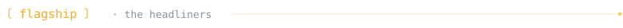
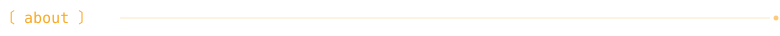
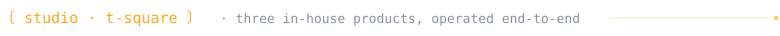
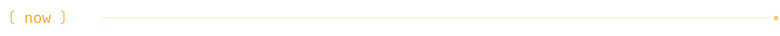
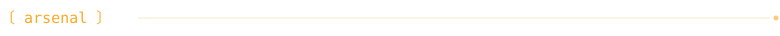
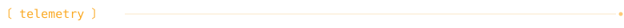
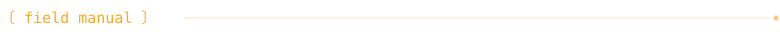
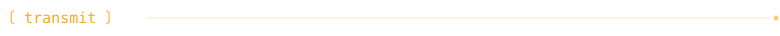

<div align="center">

<a href="https://github.com/fatihkan">
  
</a>

<br/>

<a href="http://www.fatihkan.com.tr"></a>


</div>

<br/>

<div align="center">
<sub><code>「 we don't disappear at launch — we run what we build 」</code></sub>
</div>

<br/>



<table border="0" cellspacing="0" cellpadding="0">
<tr>
<td valign="top" width="48%">

#### <a href="https://github.com/fatihkan/wallnetic">wallnetic</a>

Cinematic live wallpapers for macOS — turn any video you own into a living 4K desktop. Dynamic Island controls, per-Space & multi-monitor wallpapers, photo slideshows, effects, Liquid Glass UI. SwiftUI + Metal, sandboxed, live on the Mac App Store.

<p>
  
  
  
  
</p>

</td>
<td width="4%"></td>
<td valign="top" width="48%">

#### <a href="https://github.com/fatihkan/badi">badi</a>

Workflow management CLI for Claude Code, Cursor & Gemini CLI. 30 AI agents — incl. a virtual eng team, ads strategist, market/SEO/data analysts — 84 commands, 62 skill categories. Built for Claude Opus & Sonnet.

<p>
  
  
  
  
</p>

</td>
</tr>
</table>

<br/>



```yaml
role:         founder · principal engineer @ t-square biliṣim
studio:       senior software · LMS · AI studio — istanbul, since 2017
track_record: 9+ years · 13 brand engagements · 10 production releases
products:     blink ai · nexia academy · wallnetic · badi
focus:        ios · swift · react native · ai-native workflows · LMS
based_in:     kadıköy, istanbul · 41.0082°N, 28.9784°E
mode:         open to interesting problems
```

<br/>



<table border="0" cellspacing="0" cellpadding="0">
<tr>
<td valign="top" width="32%">

#### <a href="https://blink-ai.app">blink ai</a>

AI coaching & micro-learning platform for corporate L&D. GROW methodology + Socratic questioning, measurable skill development at scale.

<p>
  
  
  
</p>

</td>
<td width="2%"></td>
<td valign="top" width="32%">

#### <a href="https://nexiaacademy.com">nexia academy</a>

White-label LMS for education programs. Course delivery, virtual classrooms (WebRTC), learner analytics — all under partner brand.

<p>
  
  
  
</p>

</td>
<td width="2%"></td>
<td valign="top" width="32%">

#### <a href="https://apps.apple.com/pa/app/wallnetic/id6760347328?mt=12">wallnetic</a>

Native macOS live wallpaper engine — Metal-accelerated, 6 wallpaper sources, drag-and-drop video import, multi-monitor. Built native, not Electron.

<p>
  
  
  
</p>

</td>
</tr>
</table>

<sub><i>industries: edtech · corporate L&D · HR tech · fintech · healthcare · retail · b2b saas · iot</i></sub>

<br/>



```diff
+ shipped   wallnetic — live on the mac app store · liquid glass UI
+ shipping  badi v1.33 — virtual eng team, ads review, command profiles
+ shipping  blink ai — new coaching loops + analytics dashboards
~ scaling   nexia academy — multi-tenant operations
~ curating  awesome-ai-devtools — AI-powered developer tools list
~ exploring claude code agent SDK · MCP servers · multi-agent workflows
- avoiding  yak shaves
```

<br/>



<sub><code>mobile</code></sub>
<p>
  
  
  
  
  
  
</p>

<sub><code>web · backend</code></sub>
<p>
  
  
  
  
  
  
  
  
  
  
</p>

<sub><code>ai · learning</code></sub>
<p>
  
  
  
  
  
  
</p>

<sub><code>infra · ops</code></sub>
<p>
  
  
  
  
  
  
  
</p>

<br/>



<!-- numbers below are static — refresh with `gh api` on each revision -->

<table border="0" cellspacing="0" cellpadding="0">
<tr>
<td valign="top" width="53%">

```text
public repos       ────────────  82
stars earned       ────────────  44
followers          ────────────  13
on github since    ────────  oct 2010
years shipping     ────────────  15
```

</td>
<td width="4%"></td>
<td valign="top" width="43%">

<sub><code>most used languages</code></sub>

<p>
  
  
  
  
  
  
</p>

</td>
</tr>
</table>

<p align="center">
  
</p>

<picture>
  <source media="(prefers-color-scheme: dark)" srcset="https://raw.githubusercontent.com/fatihkan/fatihkan/output/github-contribution-grid-snake-dark.svg" />
  <source media="(prefers-color-scheme: light)" srcset="https://raw.githubusercontent.com/fatihkan/fatihkan/output/github-contribution-grid-snake.svg" />
  
</picture>

<br/>



<table border="0" cellspacing="0" cellpadding="0">
<tr>
<td valign="top" width="48%">

<sub><code>principles</code></sub>

```text
→ ship small, ship often
→ machines write code, humans write taste
→ if it isn't observable, it isn't done
→ taste beats stack, every time
→ delete more than you add
```

</td>
<td width="4%"></td>
<td valign="top" width="48%">

<sub><code>stack of choice (2026)</code></sub>

```text
mobile    swift · react native · kotlin
web       next.js · react · typescript
backend   node.js · laravel · postgres
ai layer  claude code · agent SDK · MCP
infra     aws · hetzner · docker · gha
editor    xcode · cursor · vim
shell     zsh + fzf + ripgrep + bat
```

</td>
</tr>
</table>

<br/>

<div align="center">
<sub><code>「 build like it ships tomorrow · run it like it shipped yesterday 」</code></sub>
</div>

<br/>



<div align="center">

<p>
  <a href="https://tsquare.com.tr/"></a>
  <a href="https://www.linkedin.com/in/fatihkan/"></a>
  <a href="https://x.com/KanFatih"></a>
  <a href="http://www.fatihkan.com.tr"></a>
  <a href="mailto:fatih@tsquare.com.tr"></a>
</p>

<sub><i>got a project worth releasing? · info@tsquare.com.tr</i></sub>

</div>

<br/>

<div align="center">
<sub><code>·  ·  ·  shipping from istanbul  ·  ·  ·</code></sub>
</div>
